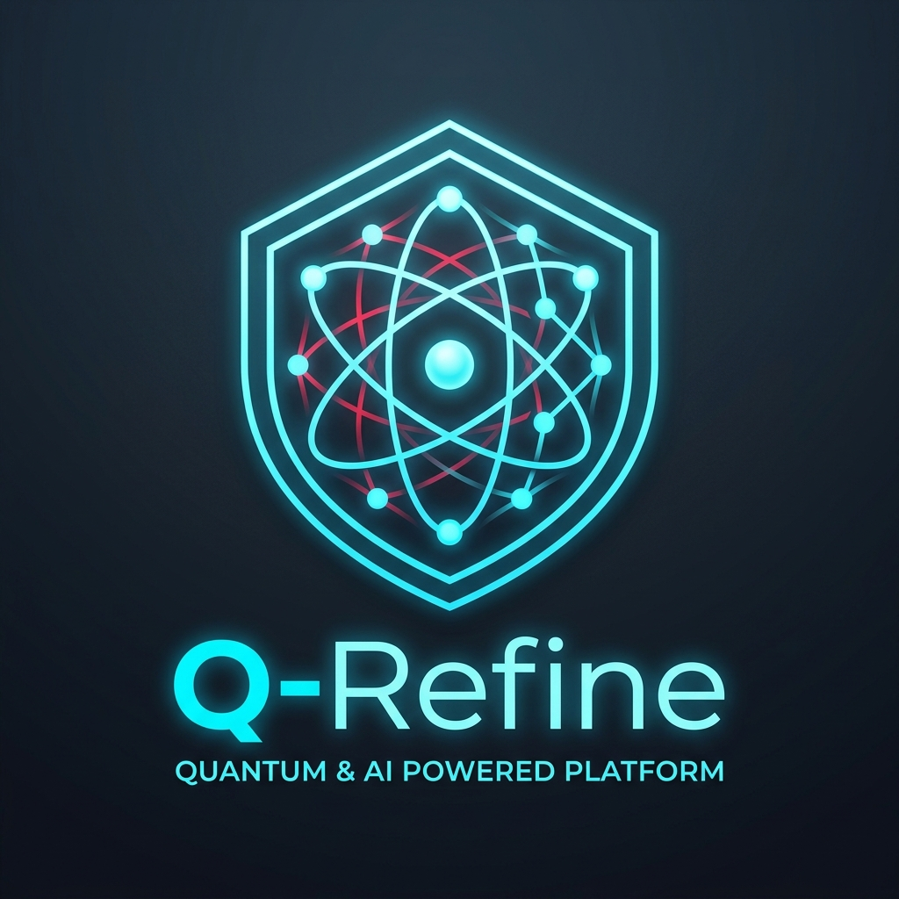

<div align="center">
  

  <h1>Q-Refine ⚛️</h1>

  <p><em>An open-source educational utility and platform for evaluating hardware noise in Quantum circuits and visualizing Zero-Noise Extrapolation (ZNE) mitigation.</em></p>

  <p>
    
    
    
    
    
    
  </p>

  <p>
    <a href="https://q-refine.streamlit.app/"></a>
  </p>

  <p>
    <a href="#-quick-start">🚀 Quick Start</a> •
    <a href="#-how-to-run-3-ways">💻 Demos</a> •
    <a href="#-architecture">🏗️ Architecture</a> •
    <a href="https://github.com/shlok926/q-refine/issues">🐞 Report Bug</a>
  </p>
</div>

---

## 🎯 Key Features at a Glance

| 🧠 Quantum AI Circuits | 📡 Hardware Profiling | 🛡️ ZNE Mitigation | 🗺️ Topology Optimizer |
| :--- | :--- | :--- | :--- |
| **Complete Algorithm Suite**<br>Benchmarks QNNs, VQE, Bernstein-Vazirani, Simon's, Grover's, and QFT. | **Advanced Noise Models**<br>Tests Depolarizing, Amplitude Damping, Phase Damping, and live IBM T1/T2 times. | **ZNE Implementation**<br>Custom circuit folding and Richardson extrapolation for error mitigation. | **Smart Routing**<br>Analyzes physical backend layout to minimize SWAP gate errors. |

---

## 📑 Table of Contents
- [🎯 Key Features at a Glance](#-key-features-at-a-glance)
- [🛠️ Installation](#️-installation)
- [🚀 How to Run (3 Ways)](#-how-to-run-3-ways)
- [🏗️ Architecture](#️-architecture)
- [🌍 Applications & Use Cases](#-applications--use-cases)
- [🔮 Future Scope](#-future-scope)
- [🛡️ Security Note](#️-security-note)
- [🤝 Contributing & Feedback](#-contributing--feedback)
- [⭐ Show Your Support](#-show-your-support)
- [👤 Author & Contact](#-author--contact)

---

## 🛠️ Installation

```bash
# Clone the repository
git clone https://github.com/shlok926/q-refine.git
cd q-refine

# Install dependencies
pip install qiskit>=1.0.0 qiskit-aer>=0.14.0 matplotlib numpy streamlit>=1.30.0 jupyter
```

---

## 🚀 How to Run (3 Ways)

Q-Refine is designed for different types of users, from enterprise managers to core quantum researchers.

### 1. 🌐 The Streamlit Web Dashboard (Live Cloud & Local)
You can test the platform instantly without installing anything via our cloud deployment:
👉 **[Live Cloud Dashboard: q-refine.streamlit.app](https://q-refine.streamlit.app/)**

Or run it locally on your own machine:
```bash
streamlit run app.py
```
*This will open a browser window at `http://localhost:8501`.*

### 2. ⚡ The Command-Line Pipeline (For Automation & CI/CD)
Run the automated pipeline to execute the entire benchmarking process in one shot. It will print the analysis and generate a `q_refine_dashboard.png` image.
```bash
python q_refine_pipeline.py
```

### 3. 📓 Jupyter Notebook (For Developers & Researchers)
If you want to play with the Q-Sanitizer step-by-step or modify the circuits mathematically, use the interactive notebook.
```bash
jupyter notebook demo.ipynb
```

---

## 🏗️ Architecture

```text
q_refine/
├── circuits/            # Quantum Algorithms (QNN, VQE, BV, Simon's, Grover, QFT)
├── benchmark_engine/    # Hardware Profilers & IBM Digital Twins
├── mitigation_engine/   # Custom ZNE Engine & Topology Optimizers
└── core/                # Dashboards & Utilities
```

---

## 🌍 Applications & Use Cases

Q-Refine is built to accelerate research and production in the most critical areas of quantum computing:
*   **Quantum Machine Learning (QML) & Quantum AI:** Evaluate how hardware noise degrades the accuracy of Parameterized Quantum Circuits (PQCs) and Quantum Neural Networks, and use ZNE to restore predictive power.
*   **Quantum Cryptography & Security:** Benchmark cryptographic cracking algorithms (like Grover's) against real-world decoherence to understand the true timeline and threat level of quantum attacks.
*   **Quantum Hardware Development:** Hardware engineers can use Q-Refine as a diagnostic tool to test the efficacy of their physical qubits against standard algorithmic workloads.

---

## 🔮 Future Scope

While Q-Refine is actively being developed, the roadmap for future expansion includes:
1.  **Machine Learning Predictor:** Utilizing classical ML models to predict the robustness of arbitrary quantum circuits before execution.
2.  **Live QPU Execution:** Transitioning from Digital Twins (FakeBackends) to live, queued execution on IBM's physical Quantum Processing Units (QPUs) using premium cloud accounts.
3.  **Hybrid Algorithm Support:** Adding support for QAOA (Quantum Approximate Optimization Algorithm) for solving logistics and financial modeling problems under noisy conditions.

---

## 🛡️ Security Note
This tool evaluates algorithms locally. If you switch `use_real_hardware=True` in the Profiler, ensure your IBM Quantum API Token is saved using `QiskitRuntimeService.save_account()` and **never** hardcoded into the scripts.

---

## 🤝 Contributing & Feedback

Contributions, suggestions, and feedback are highly welcome!

*   **Got suggestions or feature requests?** Feel free to open a new [Issue](https://github.com/shlok926/q-refine/issues) or share your ideas.
*   **Want to contribute?** Feel free to fork this repository, make your changes, and submit a Pull Request.

---

## ⭐ Show Your Support

<div align="center">
  <b>Love this tool? Help us grow:</b>
</div>

```text
✨ Star the repository    (GitHub Star Button)
🐛 Report bugs            (GitHub Issues)
💡 Suggest features       (GitHub Discussions)
📣 Share with others      (LinkedIn/Twitter)
🤝 Contribute code        (Pull Requests)
```

---

## 👤 Author & Contact

<div align="center">
  <b>👨‍💻 Shlok Thorat</b> <br>
  <i>Let's connect on LinkedIn, collaborate, and build amazing things together!</i>
  <br><br>

  <a href="mailto:shlokthorat29075@gmail.com"></a>
  <a href="https://github.com/shlok926"></a>
  <a href="https://www.linkedin.com/in/shlok-thorat-39916a405/"></a>
  
  <br><br>
  Made with Shlok!for Quantum Computing Innovation • <a href="#-q-refine-quantum-ai-robustness-benchmark">Back to Top</a>
</div>
